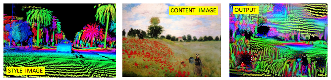

# Deep Steeze

TensorFlow implementation of neural style transfer. The below example shows
style transfer from a `content image`, the Louvre, and a `style image`, a
Monet painting. The output image combines the large scale structure of
the content image, and the small scale representations of the style image.

</p>

<p align="center">
  
</p>

</p>

## Methodology

The file `style_transfer.py` takes the following steps.

    1. Load content and style image
    2. Assign the content image to be the input of the VGG model.

Load pretrained VGG19 model (`nst_utils.py` from MatConvNet).
```
model = load_vgg_model("pretrained-model/imagenet-vgg-verydeep-19.mat")
```

For style transfer of mid-scale features, a mid level convolution layer
is chosen. Better results are achieved when style costs are merged from
several different layers.

    3. Select the output tensor of layer `conv4_2`
    4. Set the hidden layer activation from the layer we have selected

Continue to define the layer style cost and total cost to optimize.

    5. Compute the content cost
    6. Assign the input of the model to be the "style" image
    7. Compute the style cost and specify optimizer

Finally, run the NN with many iterations. Images start to look good at 500,
but the longer it runs the more refined the image will get.
```
generated_image = model_nn(sess,
                           generated_image,
                           filename='monet-lidar',
                           num_iterations=2000)
```

# Usage

Customise the input images in `style_transfer.py`


```
    # ================== INPUTS =======================
    # Load content and style image
    content_image = scipy.misc.imread("images/001_monet.jpg")
    content_image = reshape_and_normalize_image(content_image)

    style_image = scipy.misc.imread("images/lidar-palo-alto_small.png")
    style_image = reshape_and_normalize_image(style_image)

    assert style_image.shape == content_image.shape
    generated_image = generate_noise_image(content_image)
    # =================================================
```

</p>

Run `style_transfer.py`

Generated images will be saved every 20 iterations to `output/filename/image.jpg`,
and session time will be printed to the console.

</p>

<p align="center">
  
</p>

MIT License